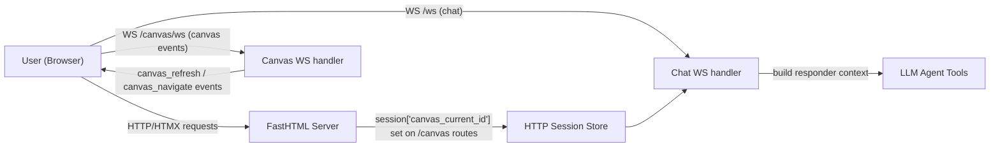
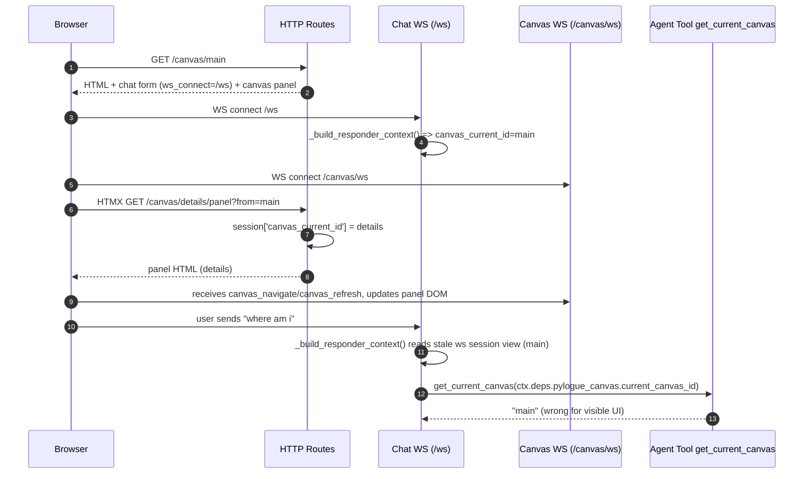
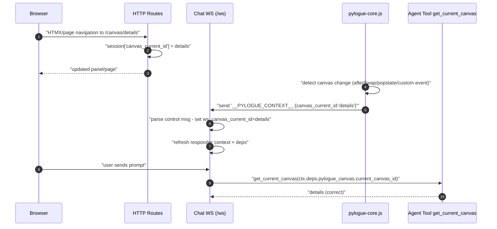

# Canvas WebSocket State Transitions

This doc explains how canvas/chat state moves through HTTP and WebSocket channels, why drift happened, and how the context-sync patch fixes it.

## 1) Runtime channels and ownership

Key point: chat context (`ctx.deps.pylogue_canvas.current_canvas_id`) is resolved inside chat WS flow, not from the visible canvas DOM directly.

## 2) Pre-fix sequence (state drift bug)

Why this happens: long-lived WS session state can be stale relative to later HTTP route updates unless explicitly synchronized.

## 3) Post-fix sequence (explicit WS context sync)

## 4) Current invariants to rely on

1. Visible canvas changes must trigger a context-sync control message on chat WS before the next user prompt.
2. Chat WS context resolver should prefer `ws_canvas_current_id` over HTTP session fallback.
3. Agent tools should treat `ctx.deps.pylogue_canvas.current_canvas_id` as the authoritative active canvas for that chat turn.

## 5) Quick debugging checklist

1. In browser devtools, verify chat WS sends `__PYLOGUE_CONTEXT__:{...}` after canvas swap/navigation.
2. In server logs, verify chat WS receives the context prefix branch before the next prompt.
3. Print `ctx.deps` in a tool call and confirm `pylogue_canvas.current_canvas_id` matches breadcrumb canvas.
4. If mismatch appears, inspect whether a canvas change event fired without `sendCanvasContextIfNeeded()`.
