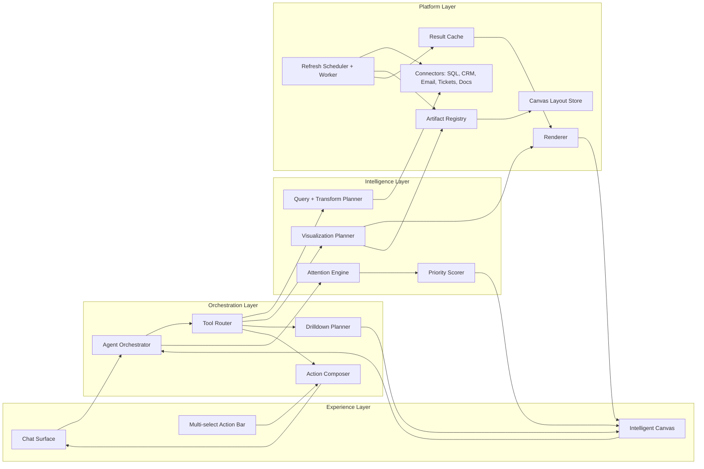
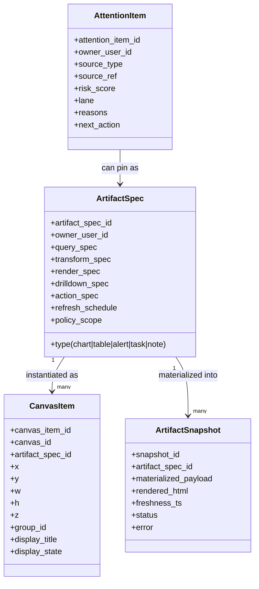
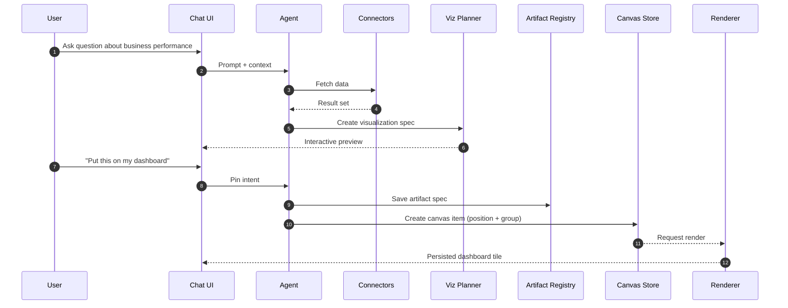
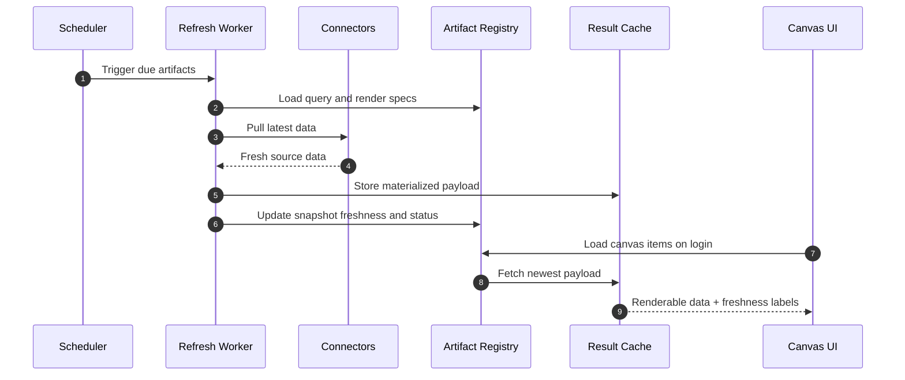
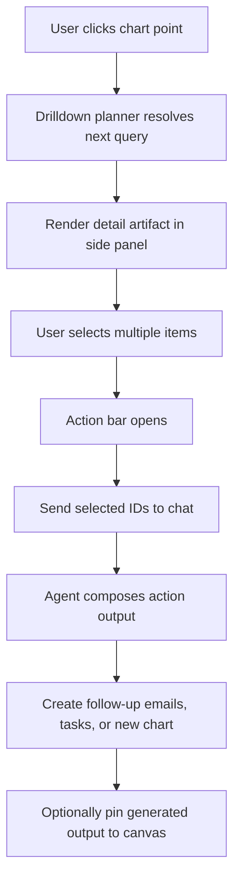
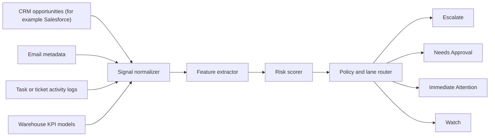

# Intelligent Canvas

## Why this feature exists

The goal is to evolve Pylogue from chat-only analytics into a persistent personal operating surface for leaders.
The user can ask questions across connected enterprise systems, generate visualizations, and pin useful outputs to a long-lived dashboard canvas.
The canvas should auto-refresh from live data and proactively surface high-risk items like contract risk, blocked approvals, or stale follow-ups.
Every artifact should support drilldown and action loops back into chat.

## Product intent

1. Let users ask in chat and get answers from connected business systems and operational tools.
2. Let users pin any useful output to a personalized dashboard canvas.
3. Keep pinned artifacts fresh through scheduled refresh and on-demand reruns.
4. Add an attention layer that groups urgent issues by actionability.
5. Enable drilldown and multi-select so users can trigger follow-up workflows.

## Scope

### In scope

1. Persistent canvas layout and pinned artifacts per user.
2. Artifact model that stores query and rendering specs, not only raw HTML.
3. Refresh jobs with freshness state and error handling.
4. Attention engine with grouped cards (`Escalate`, `Needs Approval`, `Immediate Attention`, `Watch`).
5. Drilldown interactions and multi-select to chat actions.

### Out of scope for v1

1. Multi-user real-time collaborative editing on the same canvas.
2. Arbitrary external workflow execution without approval policy.
3. Full universal BI semantics across every data backend.
4. Connectors for SQL-like sources, CRM systems (for example Salesforce), email, and other operational systems.

## Layered architecture



## Core object model

Treat each dashboard element as an artifact instance referencing a canonical artifact spec.



## Primary user flows

### Flow A: Ask, visualize, pin, persist



### Flow B: Daily auto-refresh when user logs in



### Flow C: Click drilldown and multi-select actions



## Attention engine design

Signal examples:
1. Contract or renewal risk with near-term deadline.
2. Approval or dependency pending beyond threshold days.
3. Follow-up stale based on last touch.
4. High-value opportunity with no recent movement.

Lane assignment:
1. `Escalate`: high risk and high business impact.
2. `Needs Approval`: blocked items requiring explicit user decision.
3. `Immediate Attention`: action needed today or next business day.
4. `Watch`: non-urgent monitoring cards.



## D2 view: system context

```d2
direction: right

user: "Executive User"
chat: "Chat Interface"
canvas: "Intelligent Canvas"
agent: "Agent Orchestrator"
tools: "Tool Router"
connectors: "Connectors\n(SQL, CRM, Email, Tickets, Docs)"
artifact: "Artifact Registry"
layout: "Canvas Layout Store"
scheduler: "Refresh Scheduler"
worker: "Refresh Worker"
cache: "Snapshot Cache"
attention: "Attention Engine"

user -> chat: "Ask, pin, drilldown"
user -> canvas: "View, select, act"

chat -> agent: "Intent + context"
canvas -> agent: "Interaction events"
agent -> tools
tools -> connectors: "Fetch source data"
tools -> artifact: "Save/load specs"
artifact -> layout: "Canvas placement"
scheduler -> worker: "Run due jobs"
worker -> connectors: "Refresh data"
worker -> cache: "Store snapshot"
worker -> artifact: "Update freshness"
agent -> attention: "Evaluate signals"
attention -> canvas: "Grouped priority cards"
cache -> canvas: "Renderable payload"
```

## D2 view: storage model

```d2
direction: down

users: {
  shape: sql_table
  id: "pk"
  email: "string"
}

canvas: {
  shape: sql_table
  canvas_id: "pk"
  owner_user_id: "fk -> users.id"
  title: "string"
}

artifact_specs: {
  shape: sql_table
  artifact_spec_id: "pk"
  owner_user_id: "fk -> users.id"
  type: "chart|table|alert|task|note"
  query_spec: "jsonb"
  transform_spec: "jsonb"
  render_spec: "jsonb"
  drilldown_spec: "jsonb"
  action_spec: "jsonb"
  refresh_schedule: "cron"
  policy_scope: "jsonb"
}

canvas_items: {
  shape: sql_table
  canvas_item_id: "pk"
  canvas_id: "fk -> canvas.canvas_id"
  artifact_spec_id: "fk -> artifact_specs.artifact_spec_id"
  x: "int"
  y: "int"
  w: "int"
  h: "int"
  z: "int"
  group_id: "string"
  display_state: "jsonb"
}

artifact_snapshots: {
  shape: sql_table
  snapshot_id: "pk"
  artifact_spec_id: "fk -> artifact_specs.artifact_spec_id"
  payload: "jsonb"
  rendered_html: "text"
  freshness_ts: "timestamp"
  status: "ok|stale|error"
  error: "text"
}

attention_items: {
  shape: sql_table
  attention_item_id: "pk"
  owner_user_id: "fk -> users.id"
  source_type: "string"
  source_ref: "string"
  risk_score: "float"
  lane: "escalate|approval|immediate|watch"
  reasons: "jsonb"
  next_action: "jsonb"
}

users -> canvas
users -> artifact_specs
users -> attention_items
canvas -> canvas_items
artifact_specs -> canvas_items
artifact_specs -> artifact_snapshots
```

## Interaction contracts

Chat intents to support:
1. `pin_artifact`: put current output on dashboard.
2. `group_on_canvas`: move selected items into named group.
3. `drilldown`: open deeper view from selected datum.
4. `act_on_selection`: create emails, tasks, summaries, or charts from selected items.
5. `set_refresh_policy`: set cadence and data source for artifact.

Canvas events to emit:
1. `tile_clicked`
2. `tile_selected`
3. `selection_changed`
4. `drilldown_requested`
5. `action_requested`

## Security and governance

1. Store connector credentials outside artifact specs; keep only references.
2. Enforce row and field policies per connector and user identity.
3. Audit every refresh and every AI action against selected items.
4. Require explicit confirmation for outbound actions (for example, email send).
5. Mark low-confidence recommendations and show reasons.

## Metrics

1. Percentage of pinned artifacts with successful daily refresh.
2. Time from risk signal creation to user action.
3. Precision and recall of attention lane assignments.
4. Drilldown success rate and completion rate.
5. Multi-select action conversion rate.

## Suggested implementation phases

1. Phase 1: Artifact registry + canvas persistence + manual pin.
2. Phase 2: Scheduled refresh + freshness state + error handling.
3. Phase 3: Attention engine + grouped executive lanes.
4. Phase 4: Drilldown planner + multi-select action workflows.
5. Phase 5: Confidence tuning, policy hardening, and feedback loops.
